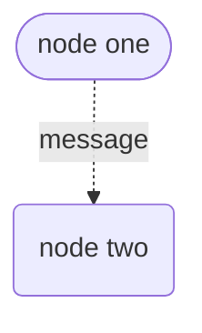
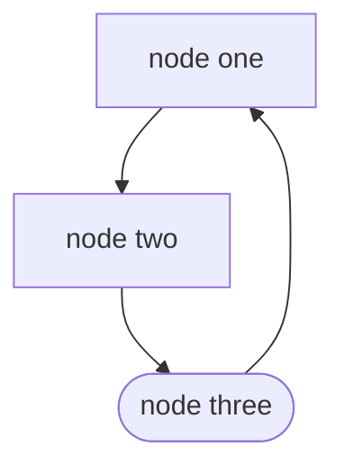
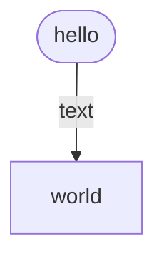
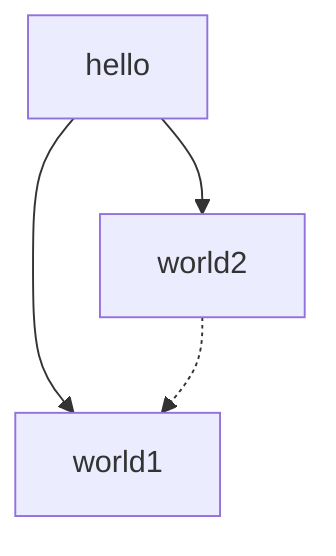

```mermaidflowchart TD;
1([node1])-.->|Text|2(node2)
3(node3)-->|Text|4(node4)
1([node1])-->|Text|3(node3)
```
```mermaid
flowchart TD;
1[live]--|okay not|2([with space])
```

```mermaid
flowchart TD;
1([node one])-.->|message|2(node two)
```

```mermaid
flowchart TD;
1[node one]-->2[node two]
2[node two]-->3([node three])
3([node three])-->1[node one]
```


```mermaid
flowchart TD;
1([hello])-->|text|2[world]
```


```mermaid
flowchart TD;
1[hello]-->2[world1]
1[hello]-->3[world2]
3[world2]-.->2[world1]
```

